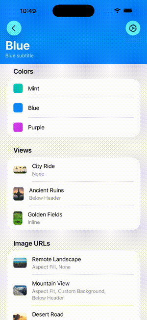
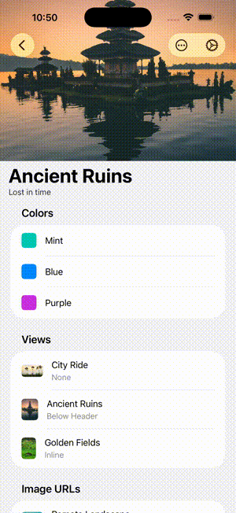
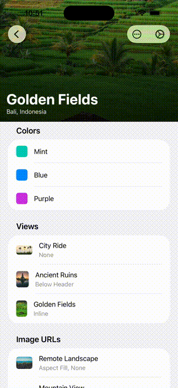
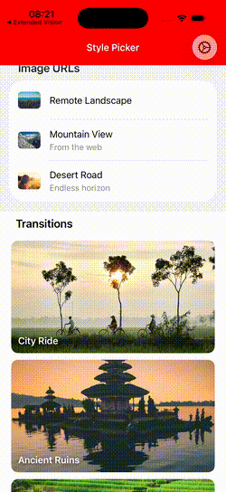

# HeroKit

A lightweight UIKit library for collapsible navigation headers on iOS.

HeroKit lets you add image headers, colored bars, or custom views that collapse smoothly on scroll — filling the gap left by iOS 26, which removed support for colored navigation bars with large titles.

<p>
  
  
  
  
</p>

## Features

- **Header Styles**
  - Image headers
  - Remote image headers
  - Colored opaque headers
  - Custom `UIView` headers
  - Large titles (below header or inline)
  - Subtitles, stretch & bounce, dimming
- **Matched Transitions** — morph a source element into the destination's header
- **Programmatic Control & Delegates** — expand, collapse, and respond to scroll events

## Requirements

- iOS 17+
- Swift 6.2+
- No external dependencies

## Installation

### Swift Package Manager

Add HeroKit via **File > Add Package Dependencies...** in Xcode with:

```
https://github.com/mobilepur/hero-kit
```

Or in your `Package.swift`:

```swift
dependencies: [
    .package(url: "https://github.com/mobilepur/hero-kit", from: "0.1.2")
]
```

## Quick Start

```swift
import HeroKit

class PhotoViewController: UICollectionViewController {
    override func viewDidLoad() {
        super.viewDidLoad()

        setHeader(
            .image(
                image: .init(url: URL(string: "https://example.com/photo.jpg")!),
                configuration: .init(height: 300),
                title: .init(title: "Explore", largeSubtitle: "Discover new places")
            )
        )
    }
}
```

### Matched Transitions

Present a view controller with a morph animation from a source element to the destination's header:

```swift
heroPresent(detailVC, source: selectedCell)
```

The source conforms to `HeroTransitionSource`. Dismiss reverses the animation automatically.

## Documentation

See [docs/HeroKit.md](docs/HeroKit.md) for the full API reference — header styles, configuration options, delegates, programmatic control, and navigation bar restoration.

## License

MIT
